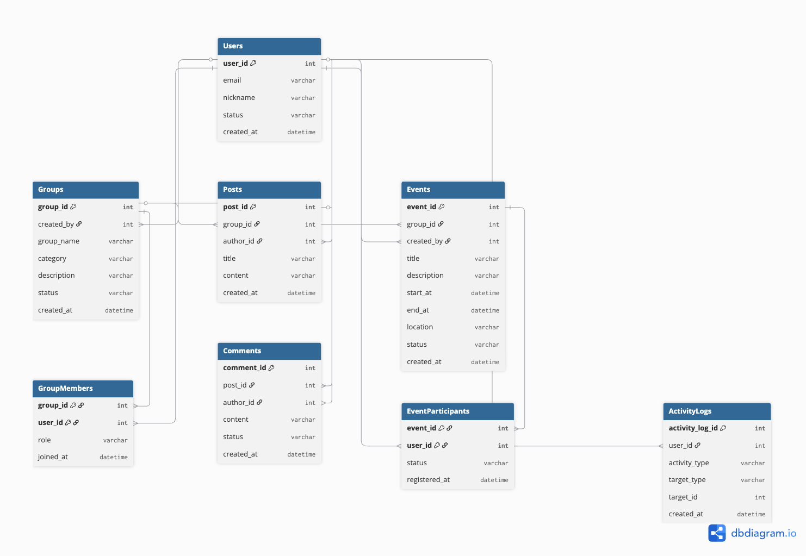

# Schema Design

This document describes the database schema and the design decisions.

## Entities

- Users
- Groups
- GroupMembers
- Posts
- Comments
- Events
- EventParticipants
- ActivityLogs

## Entity Relationship Diagram

The following diagram represents the relationships between the core entities in ActivityHub.

## Users

## Groups

## GroupMembers

## Posts

Posts store content created by users within groups.

### Comment Count

The `comment_count` value is not stored directly in the Posts table.

Comment counts can be derived from the Comments table using aggregation. Storing the count separately could introduce redundant data and consistency issues when comments are created or deleted.

The initial schema therefore maintains a normalized structure. The performance of comment count queries will be evaluated during query performance analysis, and denormalization may be considered if aggregation becomes a significant performance bottleneck.

## Comments

Comments store user-written responses to posts.

### Soft Delete

Comments are not physically deleted from the database. A status value is used to mark deleted comments so that comment records can be retained for auditing and operational purposes.

Deleted comments are not displayed to users as normal content.

## Events

### Event Status

Event status is stored separately from the event schedule because cancellation and operational completion cannot always be determined from start and end times alone.

## EventParticipants

### Composite Primary Key

The combination of `event_id` and `user_id` is used as the primary key.

Each row represents the participation relationship between one user and one event. Since a user can participate in the same event only once, the combination of `event_id` and `user_id` uniquely identifies each participation record.

A separate `participant_id` is not introduced because the participation record does not need an independent identifier in the current schema.

## ActivityLogs

ActivityLogs store chronological user activity records for operational monitoring and query performance analysis.

### Activity Target

The `target_type` and `target_id` columns are used to identify the object associated with an activity.

For example, a `CREATE_POST` activity may reference a Post, while a `JOIN_GROUP` activity may reference a Group.

This structure allows different types of activity targets to be represented using a common log schema without adding a separate foreign key column for every target entity.

However, because `target_id` may refer to different tables depending on `target_type`, a standard foreign key constraint cannot directly enforce referential integrity for the target.

This design favors flexibility and extensibility for activity logging, while the limitation of polymorphic target references is documented as a schema trade-off.